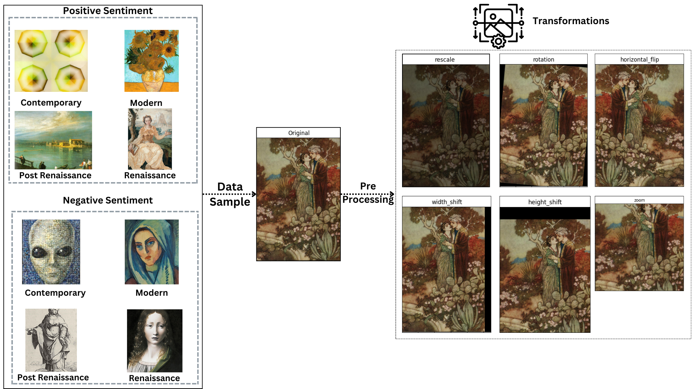

# Classifying-Art-by-Genre-and-Emotion-Evoked

This repository is dedicated to loading, preprocessing, and building models for classifying the emotions evoked by artworks.

## Data Source

This repository utilizes datasets from two primary sources: WikiArt and Artemis.

### WikiArt
WikiArt provides a meticulously curated collection of 80,020 unique images sourced from WikiArt.org. Processed by Peter Baylies, this dataset encompasses 27 distinct artistic styles and features works from 1,119 artists. With such diversity, it offers a rich resource for analysis and machine learning applications in the realm of visual art.

### Artemis
Artemis is focused on exploring the intricate relationship between visual art and the emotions it evokes, along with the linguistic justifications behind these emotional responses. Employing human annotators, Artemis identifies the primary emotion elicited by each artwork and provides a verbal explanation for the choice. This dataset comprises 455,000 emotion attributions and explanations, drawing from a diverse set of 80,000 artworks sourced from WikiArt.

#### Download Instructions
- **WikiArt Dataset:**
  - To download the WikiArt dataset, navigate to [this Kaggle link](https://www.kaggle.com/datasets/steubk/wikiart/data).
  - Download the 33.77GB dataset for images and the 12.51MB 'classes.csv' file.
  - Create an 'archive' folder to store the images and a 'data_gen' folder for the 'classes.csv' file for future reference.

- **Artemis Dataset:**
  - To download the Artemis dataset, visit [this link](https://www.artemisdataset.org/#dataset).
  - Fill out the form and proceed to download the dataset.
  - Place the downloaded file into the 'data_em' folder created above for later use.

These datasets serve as invaluable resources for studying and analyzing emotions evoked by artworks, offering a comprehensive foundation for machine learning and artistic exploration.

## Data Preparation
To effectively utilize the code, follow these steps:

1. **Loading Image Files:** 
   - Start by utilizing `Load_Files.py` from `src/data_load` to load the image files.
   - Customize the directory for the images by modifying line 106 in the script.

2. **Generating Dataset with Positive and Negative Images:** 
   - Utilize `Postive_Negative.py` from `src/data_load` to create a dataset containing both positive and negative images.
   - Ensure the existence of a 'data_em' folder containing two essential files: 'classes.csv' from WikiArt and 'artemis_dataset_release_v0.csv' from Artemis.
   - Create an 'archive' folder and a subfolder named 'positive' to store all the positive images and another subfolder named 'negative' for negative images before running the code.

3. **Generating Genre Files:** 
   - Use `Genre_Files.py` from `src/data_load` to generate files for different genres.
   - Ensure the existence of a 'data_gen' folder containing a file named 'classes.csv' from WikiArt.
   - Create an 'archive' folder and four subfolders named 'Renaissance', 'Post-Renaissance', 'Modern', and 'Contemporary' within the 'data_gen' folder.
   - Move the corresponding images into their respective genre folders.

Following these steps will aid in effectively loading, preprocessing, and organizing the necessary data for classifying the emotions evoked by artworks.

## Model Training

### Training Scripts

#### Configuration 1: Sequential Training
.jpg>)
- `Layer_4_genre_train.py`: Trains the fourth convolutional block of ResNet50 for genre classification.
- `Layer_5_emo_train_after_genre_4.py`: Trains the fifth convolutional block of ResNet50 for emotion classification after genre training on the fourth block.
- `Layer_5_train_emo.py`: Trains the fifth convolutional block of ResNet50 for emotion classification after genre training.

#### Configuration 2: Simultaneous Training
.jpg>)
- `Layer_4_and_5_genre_train.py`: Trains both the fourth and fifth convolutional blocks of ResNet50 simultaneously for genre classification.
- `Layer_4_and_5_emo_train.py`: Trains both the fourth and fifth convolutional blocks of ResNet50 simultaneously for emotion classification.
- `Layer_4_and_5_emo_after_genre_train.py`: Trains both the fourth and fifth convolutional blocks of ResNet50 for emotion classification after genre training.

#### Additional Experiment for configuration exploration
- `Layer4_emo_train.py`: Trains only the fourth convolutional block of ResNet50 for emotion classification.
- `Layer5_after_4_emo_train.py`: Trains only the fifth convolutional block of ResNet50 for emotion classification after training the fourth block on emotion. 

### Model Visualization
- `train_val_loss_vis.py` from `src/visualize`: Visualizes the training and validation loss during model training.

## Evaluation and Comparison

We evaluated the performance of the transfer learning models on two configurations: sequential and simultaneous training of the fourth and fifth layers of ResNet50. Performance metrics include accuracy and F1 score for emotion classification. The results were compared against the baseline models, which were trained directly on the emotion classification task without the transient genre training step.

### Results

Overall, we observed an improvement in accuracy in both configurations when the genre component was introduced, confirming our hypothesis that incorporating knowledge of art genres enhances emotion classification performance. 

#### Configuration 1: Sequential Training
Training the fourth convolutional block on genre followed by training the fifth convolutional block on genre resulted in a 22.3% improvement in accuracy and a 4.2% improvement in F1 Score compared to baseline values (Table 1).

| Fine-tuning Process          | Output Observed  | Layers Fine Tuned | Accuracy | F1 Score |
|------------------------------|------------------|-------------------|----------|----------|
| Trained on Genre (transient) | Genre            | Conv4             | 63.8%    | 0.6      |
| Trained on Emotions          | Emotions Evoked  | Conv5             | 56.3%    | 0.71     |
| Trained on Genre then Emotions | Emotions Evoked | Conv4 then Conv5 | 68.9%    | 0.74     |

**Table 1:** Experimental Conditions and Performance Comparison of Configuration 1.

#### Configuration 2: Simultaneous Training
Training both the fourth and fifth blocks simultaneously, incorporating genre information, led to a 6.3% improvement in accuracy and a 3% improvement in F1 Score compared to baseline values (Table 2).

| Fine-tuning Process          | Output Observed  | Layers Fine Tuned | Accuracy | F1 Score |
|------------------------------|------------------|-------------------|----------|----------|
| Trained on Genre (transient) | Genre            | Conv4 & Conv5     | 62.9%    | 0.61     |
| Trained on Emotions          | Emotions Evoked  | Conv4 & Conv5     | 50.6%    | 0.66     |
| Trained on Genre then Emotions | Emotions Evoked | Conv4 & Conv5     | 53.8%    | 0.68     |

**Table 2:** Experimental Conditions and Performance Comparison of Configuration 2.

Training the fourth and fifth layers sequentially in Configuration 1 outperformed simultaneous training in Configuration 2. Additionally, an extra experiment training the fourth convolutional block on emotion only yielded valuable insights.

| Fine-tuning Process          | Output Observed  | Layers Fine Tuned | Accuracy | F1 Score |
|------------------------------|------------------|-------------------|----------|----------|
| Trained on Emotions          | Emotions Evoked  | Conv4             | 67.8%    | 0.76     |
| Trained on Emotions          | Emotions Evoked  | Conv4 then Conv5 | 69.2%    | 0.75     |

**Table 3:** Sequential Training of the fourth convolutional block of pre-trained ResNet50 followed by the fifth convolutional block on emotions only.

This experiment revealed that training only the fourth convolutional block on emotion, without training the last convolutional block, achieved the highest F1 score. This suggests that there are ways to optimize the model further to enhance its learning of emotion classification before including the information introduced by the genre contextual cues.

### Main Takeaways
- Incorporating knowledge of art genres improves emotion classification accuracy in artworks.
- Sequential training of convolutional blocks yields better performance than simultaneous training.
- Further optimization using emotion labels only before incorporating genre labels could enhance model performance.

Moving forward, we plan to explore additional model configurations and incorporate explainability components like Gradient-weighted Class Activation Mapping (Grad-CAM) to better understand how decisions are made in the modeling process. This understanding will inform the incorporation of the most important contextual cues from genre in the emotion classification problem.

## Conclusion

Our study confirms that incorporating genre information improves emotion classification accuracy in artworks. Leveraging transfer learning techniques and pre-trained ResNet50 models, we explored the relationship between art genres and the emotions they evoke. Furthermore, sequential training of convolutional blocks yielded better performance than simultaneous training. These insights pave the way for more accurate emotion classification in art, highlighting the importance of considering multiple experiment configurations to enhance emotion classification performance.

For a more detailed analysis and discussion, please refer to our [full report](Genre_to_Emotion_Classification.pdf).

Moving forward, we plan to explore further model configurations to optimize emotion classification using emotion labels only. Once we establish the optimal spot achievable using just emotion labels, we will incorporate genre contextual cues to further leverage the contribution of genre to this space. Additionally, we aim to incorporate an explainability component like Gradient-weighted Class Activation Mapping (Grad-CAM) to understand how decisions are made in the modeling process. This understanding will better inform the incorporation of the most important contextual cues from genre in the emotion classification problem.

## Note
The data is not included in this repository due to size constraints on GitHub. The data should be organized in two folders, `data_gen` for the genre folder and `data_em` for the emotion folder. The `data_gen` folder should include four subfolders with the respective genre breakdown, and the `data_em` folder should include subfolders for positive and negative emotions.
